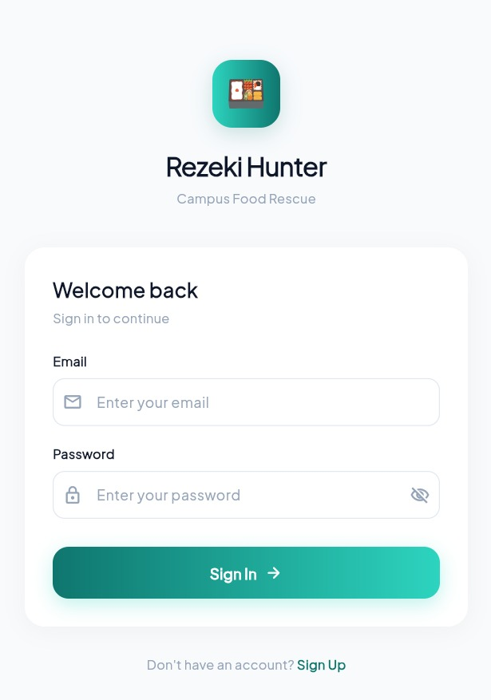
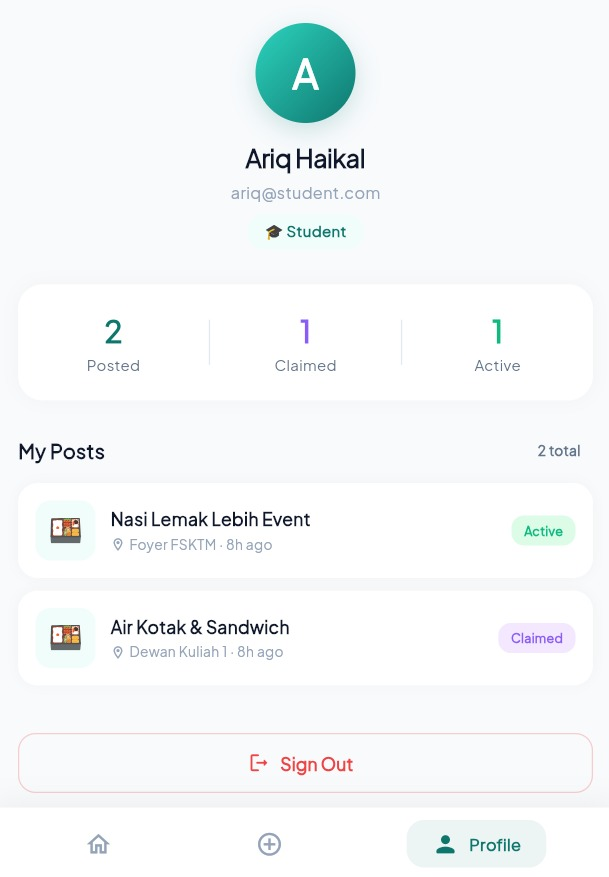
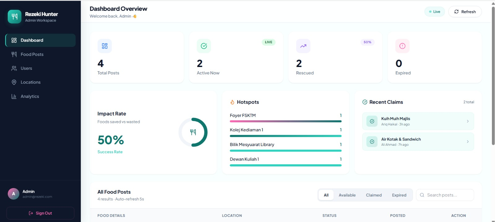

<div align="center">

# 🍎 Rezeki Hunter

**Campus Food Rescue Ecosystem**

<p>
  
  
  
  
  
</p>

A **3-tier ecosystem** connecting UPSI students with surplus food in real-time to minimize campus food waste.  
Mobile App (Student) · Admin Dashboard · RESTful API — all in one repo.

[Getting Started](#-getting-started) · [Features](#-key-features) · [Tech Stack](#%EF%B8%8F-tech-stack) · [Screenshots](#-screenshots)

</div>

---

## 📸 Screenshots

<div align="center">
<table>
  <tr>
    <td align="center" colspan="2"><h3>📱 Mobile App (Flutter)</h3></td>
  </tr>
  <tr>
    <td align="center"><b>Live Feed</b></td>
    <td align="center"><b>Login</b></td>
  </tr>
  <tr>
    <td></td>
    <td></td>
  </tr>
  <tr>
    <td align="center" colspan="2"><b>Profile & Stats</b></td>
  </tr>
  <tr>
    <td align="center" colspan="2"></td>
  </tr>
</table>

<table>
  <tr>
    <td align="center"><h3>💻 Admin Dashboard (React)</h3></td>
  </tr>
  <tr>
    <td></td>
  </tr>
</table>
</div>

---

## 🛠️ Tech Stack

| Layer | Technology | Role |
| :--- | :--- | :--- |
| **Mobile App** | Flutter (Dart) | Cross-platform app for students to post & claim food |
| **Admin Panel** | React.js + Vite + Tailwind CSS | Web dashboard for monitoring & moderation |
| **Backend API** | Laravel 11 + Sanctum | RESTful API with token-based authentication |
| **Database** | MySQL | Relational database for users, foods & claims |

### Architecture

```
┌─────────────────┐     ┌──────────────────┐
│  Flutter App     │────▶│                  │
│  (Student)       │     │  Laravel API     │──── MySQL
│                  │◀────│  (Sanctum Auth)  │
└─────────────────┘     │                  │
                         │                  │
┌─────────────────┐     │                  │
│  React Dashboard │────▶│                  │
│  (Admin)         │◀────│                  │
└─────────────────┘     └──────────────────┘
```

---

## ✨ Key Features

### 📱 Mobile App (Student)
- **Live Food Feed** — Real-time list with status badges (Available / Claimed / Expired)
- **Filter & Search** — Filter by status with chip selector
- **One-Tap Claim** — Claim available food instantly with confirmation
- **Share Food** — Upload photo, add description, tag campus location
- **Profile Dashboard** — Track personal stats (Posted / Claimed / Active)
- **Auto-Login** — Secure token storage for seamless sessions

### 💻 Admin Dashboard
- **Live Analytics** — Stats cards with auto-refresh every 5 seconds
- **Impact Rate** — SVG donut chart showing food rescued vs wasted
- **Hotspot Map** — Campus locations ranked by food activity
- **Recent Claims** — Real-time feed of latest claim activity
- **Food Management** — Full CRUD with status filters & search
- **Glassmorphism UI** — Modern design with Tailwind CSS

### 🔧 Backend API
- **RESTful Endpoints** — Clean API for both mobile & web clients
- **Laravel Sanctum** — Token-based auth with role control (Admin vs Student)
- **Image Upload** — Multipart form data handling with storage
- **Statistics Engine** — Aggregated stats for dashboard analytics

---

## 🚀 Getting Started

### Prerequisites

- PHP 8.2+ & Composer
- Node.js 18+ & NPM
- Flutter SDK 3.x
- MySQL Server

### 1. Clone the repo

```bash
git clone https://github.com/Ariqdoangg/RezekiHunter.git
cd RezekiHunter
```

### 2. Backend Setup (Laravel)

```bash
composer install
cp .env.example .env
php artisan key:generate
```

Configure `.env` with your MySQL credentials, then:

```bash
php artisan migrate --seed
php artisan serve --host=0.0.0.0
```

### 3. Admin Dashboard (React)

```bash
cd admin-panel
npm install
npm run dev
```

Open `http://localhost:5173` — Login: `admin@rezeki.com` / `password`

### 4. Mobile App (Flutter)

```bash
cd rezeki_hunter_app
flutter pub get
flutter run
```

Login: `ariq@student.com` / `password`

---

## 📁 Project Structure

```
RezekiHunter/
├── app/                    # Laravel Controllers, Models, Middleware
├── database/
│   ├── migrations/         # Database schema
│   └── seeders/            # Test data (4 users, 4 food posts)
├── routes/
│   └── api.php             # API endpoints
├── admin-panel/            # React + Vite + Tailwind
│   ├── src/
│   │   ├── components/     # Dashboard, FoodList, Sidebar
│   │   └── services/       # API service layer
│   └── package.json
├── rezeki_hunter_app/      # Flutter mobile app
│   └── lib/
│       ├── config/         # API URLs, colors, constants
│       ├── models/         # Food model
│       ├── services/       # Auth & API services
│       ├── screens/        # Splash, Login, Home, Post, Profile
│       └── widgets/        # FoodCard, FoodDetailSheet
└── README.md
```

---

## 👨‍💻 Author

**Ariq Haikal** — Final-year Software Engineering Student @ UPSI

[](https://linkedin.com/in/ariqhaikal)
[](https://github.com/Ariqdoangg)

---

<div align="center">
  <sub>Built with ❤️ for UPSI campus community</sub>
</div>
